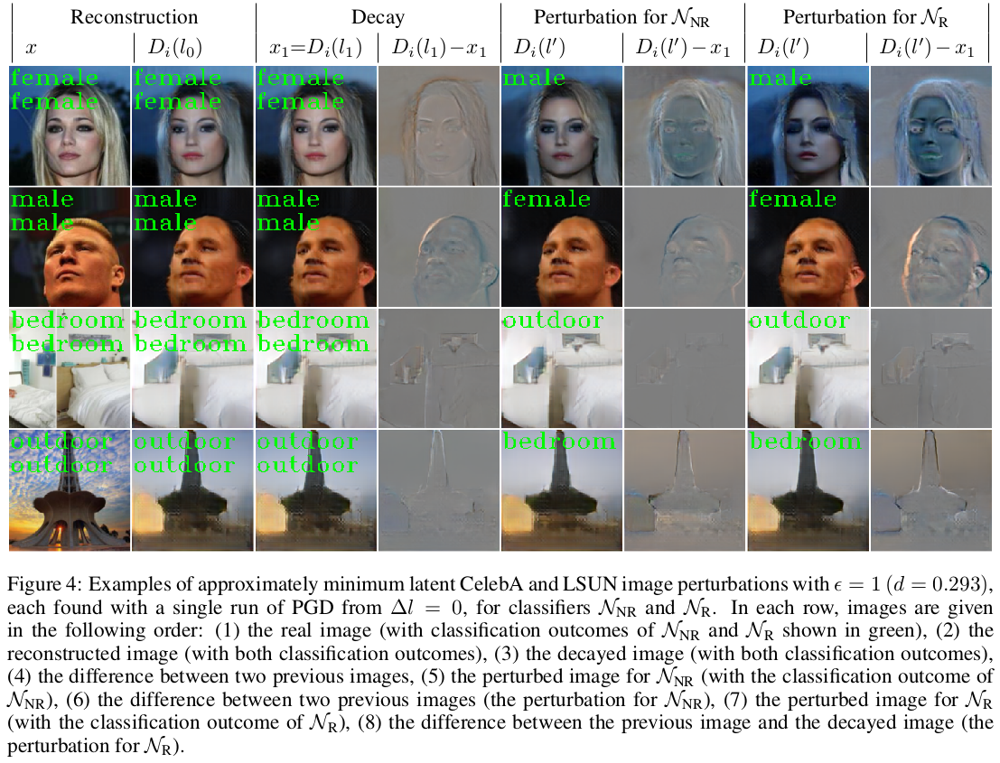

## Introduction

This toolset implements a framework to measure the performance of feed-forward artificial neural network classifiers with generative models.
This implementation only concerns image classification.
The framework is described in the following arXiv preprint:

* [Igor Buzhinsky, Arseny Nerinovsky, Stavros Tripakis. Metrics and methods for robustness evaluation of neural networks with generative models. arXiv preprint arXiv:2003.01993 (2020)](https://arxiv.org/abs/2003.01993)

Currently supported datasets: [MNIST](http://yann.lecun.com/exdb/mnist/), [CelebA](http://mmlab.ie.cuhk.edu.hk/projects/CelebA.html) (gender classification), [LSUN](https://www.yf.io/p/lsun) (scene type classification: bedrooms vs. church outdoors). For CelebA and LSUN, here are some examples of approximately minimum adversarial perturbations in latent spaces for a non-robust (NR) and a robust (R) classifier:

## Dependencies

To run the toolset, you need Python 3. Dependencies are listed in [requirements.txt](requirements.txt). If you have Anaconda, you can install them as follows (or run install.sh):

> conda create --name latent-adversarial

> conda activate latent-adversarial

> conda install --name latent-adversarial -c pytorch -c conda-forge --file requirements.txt

If there is a problem installing the specified package versions, you may try your luck and install the packages without version constraints.

If you would like to minimize the size of the installation, you may try installing packages only when you run into import errors. Many packages are needed for PIONEER generative autoencoder training which you may not need to run.

## Running (MNIST only)

The starting point is to run the toolset on MNIST, as all trained models are small and already included into this repository.

You can work with the following command-line scripts and Jupyter notebooks:

* [Adversarial.py](Adversarial.py): calculation of latent space performance metrics, including the search of latent adversarial perturbations.
* [Adversarial.ipynb](Adversarial.ipynb): this notebook shows some features supported by Adversarial.py in a more user-friendly form. The target dataset is specified in one of the top cells.
* [ClassifierTraining.py](ClassifierTraining.py): auxiliary script that implements classifier training and evaluation of their robustness in the original space.
* [ClassifierTraining.ipynb](ClassifierTraining.ipynb): this notebook shows some features supported by ClassifierTraining.py in a more user-friendly form. The target dataset is specified in one of the top cells (CelebA and LSUN only). In addition, this notebook shows image generation with robust classifiers, which is post visible on MNIST and CelebA.
* [MNIST.ipynb](MNIST.ipynb): this notebook is the adaptation of ClassifierTraining.ipynb for MNIST. In addition, it contains code to train class-specific MNIST WGANs.

Some examples of running .py scripts are given in files [ClassifierTraining.sh](ClassifierTraining.sh), [ClassifierEvaluation.sh](ClassifierEvaluation.sh), [Adversarial.sh](Adversarial.sh).

## Running (CelebA and LSUN)

CelebA and LSUN classifier models are included into the repository, but classifier training/evaluation for these datasets will require downloading these datasets. This will be done automatically for CelebA during the first run, but you will need to download LSUN on your own. You need to have the following directories:

* data/LSUN/bedroom_train_lmdb ([download archive](http://dl.yf.io/lsun/scenes/bedroom_train_lmdb.zip), size warning!)
* data/LSUN/bedroom_val_lmdb ([download archive](http://dl.yf.io/lsun/scenes/bedroom_val_lmdb.zip))
* data/LSUN/church_outdoor_train_lmdb ([download archive](http://dl.yf.io/lsun/scenes/church_outdoor_train_lmdb.zip))
* data/LSUN/church_outdoor_val_lmdb ([download archive](http://dl.yf.io/lsun/scenes/church_outdoor_val_lmdb.zip))

Evaluation of latent performance metrics for CelebA and LSUN will also require pretrained [PIONEER](https://github.com/AaltoVision/pioneer) models. You will need to download the following files (~670 MB each) and place them at the following locations:

* [pioneer/CelebA-128-female/checkpoint/20580000_state](https://drive.google.com/open?id=1X1nkyK3hkaahBYRfH36X5yyInZGYrQbW)
* [pioneer/CelebA-128-male/checkpoint/22452000_state](https://drive.google.com/open?id=1hWpm1vLXd_ay2M4AxOMxLjw4mD9gyZzH)
* [pioneer/LSUN-128-bedroom/checkpoint/15268000_state](https://drive.google.com/open?id=1sz-_3SsENJ9a4OVUF2o6q7riCcgeVlWS)
* [pioneer/LSUN-128-church_outdoor/checkpoint/20212000_state](https://drive.google.com/open?id=1eqGKeHQf-KvAe7zrvFiYjqqrEwsxvcwb)

## Working with other image datasets

Implement a new dataset wrapper in datasets.py. Add support to this dataset in cnn.py (implement new architecture if needed). Train classifiers for this dataset with ClassifierTraining.py. Then, you will need to train generative models for each image class. Two existing options are provided by generative.py:

* WGANs + image reconstruction with gradient descent (Adam). This is the simplest and the most lightweight option, but this way of reconstruction for more complex datasets will take longer and may be less precise. An example of training MNIST WGANS is given in MNIST.ipynb.
* [PIONEER](https://github.com/AaltoVision/pioneer) autoencoder. A copy of PIONEER (slightly modified) is included into this repository (pioneer/src), but if you need PIONEER on its own, take it from the original repository. Model training and loading is memory-intensive.

Alternatively, you can implement a different subclass of GenerativeModel. Even if you implement only generation (generate/decode) but not approximation in the latent space (encode), evaluation of latent space metrics based on generation should work.
